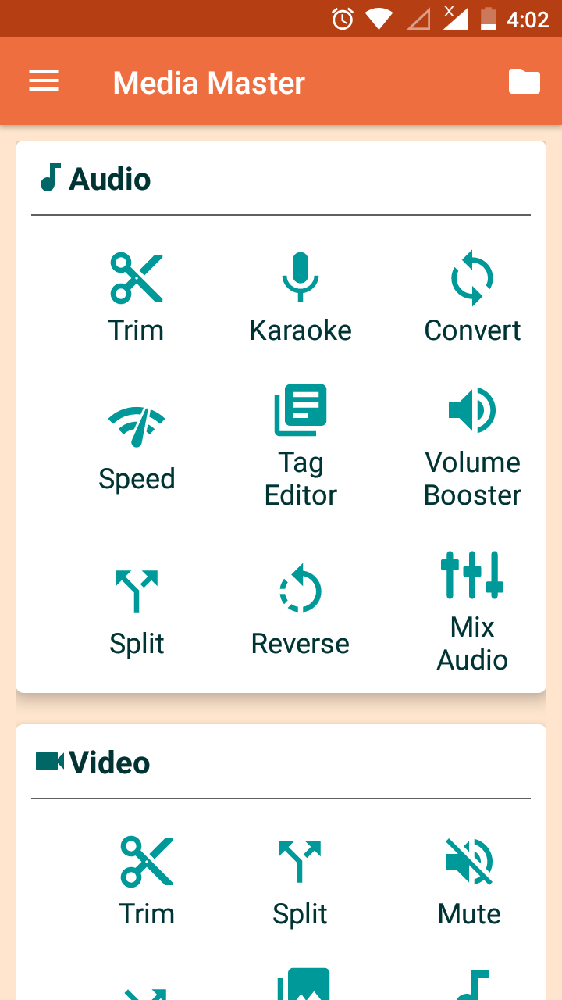
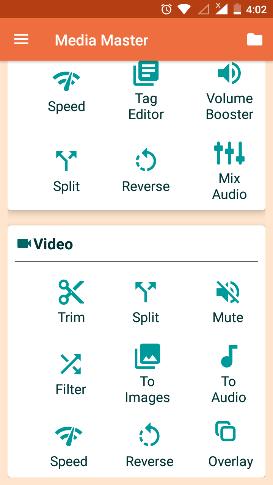

# MediaMaster Media Master : Audio Video Converter and Editor.

 Most Exciting Media Editor App with All Features, Create,Convert,Mix Multimedia.
 

Best app to Convert,edit and mix audio and video files with minimum efforts.
it only require permission to access your phone media files,no extra permission needed.

Sharing your customize audio and video file to different platforms like the Facebook, WhatsApp, Instagram made easy. Media Master lets you save your customize audio and video files with different format/extension in app.

Search functionality makes it easy to search your desired audio and video instantly
Customization will not affect your video and audio quality.

<b>Audio Features:</b>

<b>Karaoke : </b> Create Karaoke Music by removing vocal and extracting background music from Audio files.	

<b>Convert: </b> Easily Convert Audio to any Format/Extension and Bit/Frame Rate. 

<b>Speed:</b> Speed: Fast/Slow playback speed of your audio.

<b>Tag Editor:</b> Media Master lets you quickly customize all the most known tag 
information for your Audio file (Title, Artist, Album Art. etc).

<b>Volume Booster:</b> Boost your audio volume offline and save it as another format or extension.

<b>Video Features: </b>

<b>Trim: </b> Trim video clips to remove unwanted parts right on your device.

<b>Split:: </b> Split or Break Video into Multiple parts.

<b>Mute Video: </b> Remove sound from the video.

<b>Video to Audio:  </b> Convert Video file to Mp3 audio files or any other file format with custom sample rate to make high-quality audio songs, one of the Best Video to mp3 converter feature.

<b>Video to Image: </b> You can extract images from video frame with image per second and save it to formats like JPEG, PNG, tif etc.

<b>Speed: </b> Customize the speed of your Video. 

<b>Filter:</b> Various filters can be applied.

Edit your Audio and Video to different Format/Extension.

Audio Format:Mp3 M4a Aac Wav

Video Format:Mp4 Avi 3gp Flv Wmv Mov

Your feedback is valuable to us, please provide the feedback and suggestion for further improvement.

